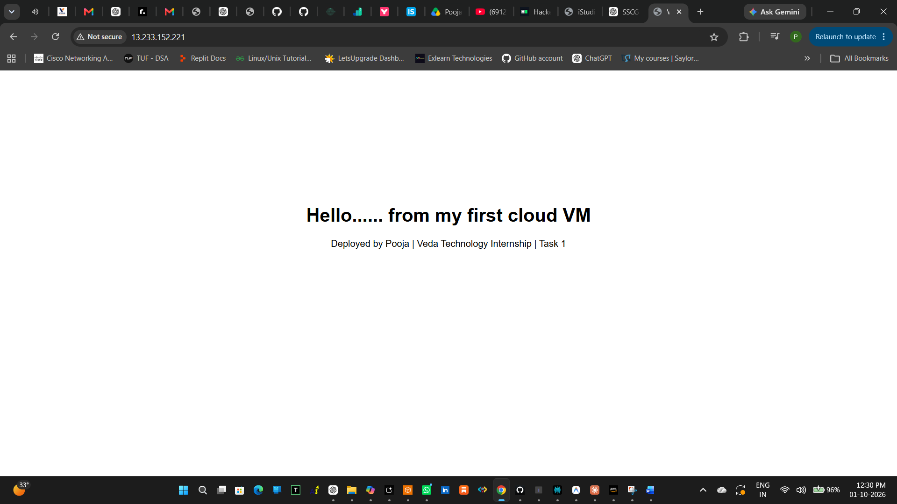
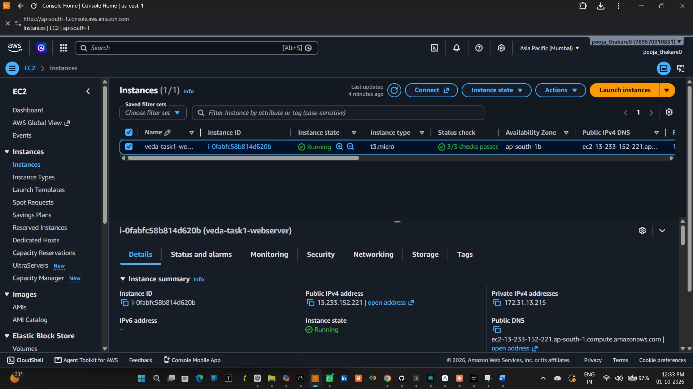
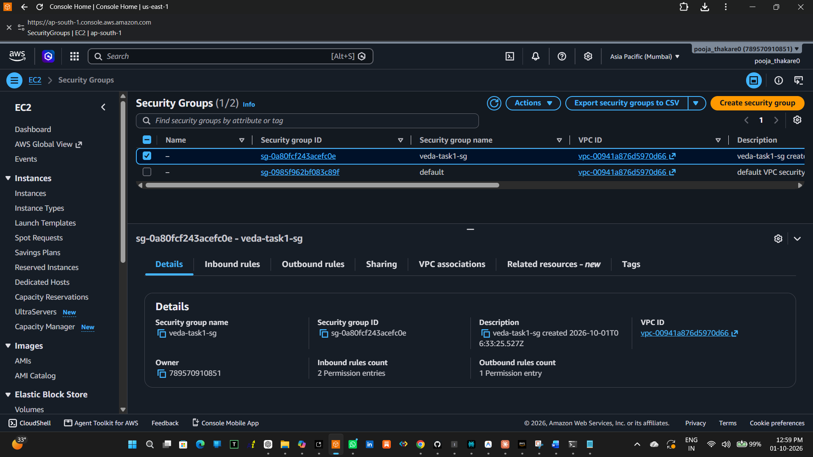
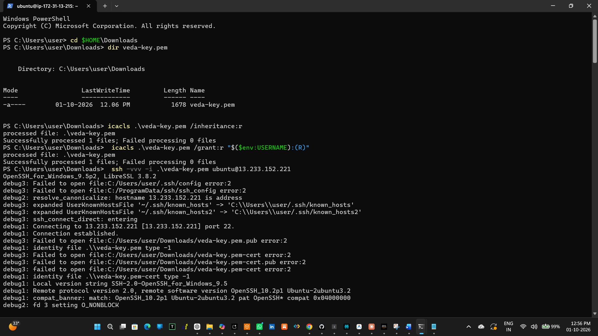
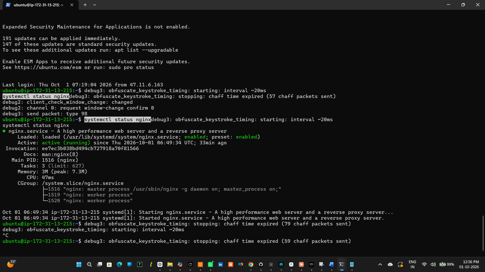

# Veda Technology Cloud Computing Internship - Task 1

## Deploy a Web Server on AWS EC2

### Objective

The objective of this task was to launch a cloud virtual machine on AWS EC2, configure a web server, and deploy a simple HTML webpage that can be accessed through the instance's public IP address.

---

## Tools and Technologies Used

- AWS EC2
- Ubuntu Server
- Nginx Web Server
- SSH
- HTML
- AWS Security Groups
- GitHub

---

## AWS Configuration

| Configuration | Details |
|---|---|
| Cloud Provider | Amazon Web Services (AWS) |
| Service | Amazon EC2 |
| Region | Mumbai (`ap-south-1`) |
| Instance Name | `veda-task1-webserver` |
| Instance Type | `t3.micro` |
| Key Pair | `veda-key.pem` |
| Security Group | `veda-task1-sg` |
| Web Server | Nginx |

---

## Deployment Process

### 1. Launch EC2 Instance

An EC2 instance was launched on AWS using an Ubuntu Server image and the `t3.micro` instance type.

A key pair named `veda-key.pem` was created for secure SSH access.

### 2. Configure Security Group

The following inbound rules were configured:

| Type | Port | Source | Purpose |
|---|---:|---|---|
| SSH | 22 | My IP | Secure SSH access |
| HTTP | 80 | Anywhere IPv4 | Access the web server |

---

### 3. Configure the Server Using User Data

A User Data script was used during instance launch to automatically:

- Update the package list
- Install Nginx
- Enable and start the Nginx service
- Create the HTML webpage

The script is available in this repository as:

[`user-data.sh`](./user-data.sh)

### 4. Deploy the Webpage

The webpage was created using HTML and deployed to the Nginx web root.

The source file is available here:

[`index.html`](./index.html)

The deployed webpage was then accessed using the EC2 instance's public IP address.

---

## SSH and Nginx Verification

After launching the instance, SSH was used to connect to the Ubuntu server.

The Nginx service was checked using:

```bash
systemctl status nginx
```
The service was successfully found to be active and running.

---

## Screenshots

### 1. Deployed Website

The webpage was successfully accessed using the EC2 public IP address.



### 2. EC2 Instance

The EC2 instance was running successfully and the instance details were verified.



### 3. Security Group

The configured inbound security group rules for SSH and HTTP were verified.



### 4. SSH Commands

The SSH connection and server commands were performed successfully.



### 5. Nginx Status

The Nginx service was checked and confirmed to be active and running.



---

## Challenges Faced

During the SSH connection, the connection initially timed out because the SSH Security Group rule contained an outdated IP address.

The SSH rule was updated to allow access from the current IP address. After updating the rule, the SSH connection was successful.

This helped me understand the importance of correctly configuring AWS Security Group rules for remote server access.

---

## What I Learned

Through this task, I learned how to:

- Launch and configure an AWS EC2 instance.
- Configure Security Group inbound rules.
- Connect to an Ubuntu cloud server using SSH.
- Install and manage the Nginx web server.
- Use EC2 User Data for automatic server configuration.
- Deploy and access a webpage using a public IP address.
- Verify a running Linux service using `systemctl`.
- Document and upload a cloud project to GitHub.

---

## Outcome

The web server was successfully deployed on an AWS EC2 cloud virtual machine using Nginx.

The HTML webpage was accessible through the EC2 instance's public IP address, and the Nginx service was verified as active and running.

---

## Repository Structure

```text
veda-task1-cloud-vm/
│
├── README.md
├── index.html
├── user-data.sh
├── 1-website.png
├── 2-instance.png
├── 3-security-group.png
├── 4-1nginx-status.png
└── 4-2nginx-status.png
